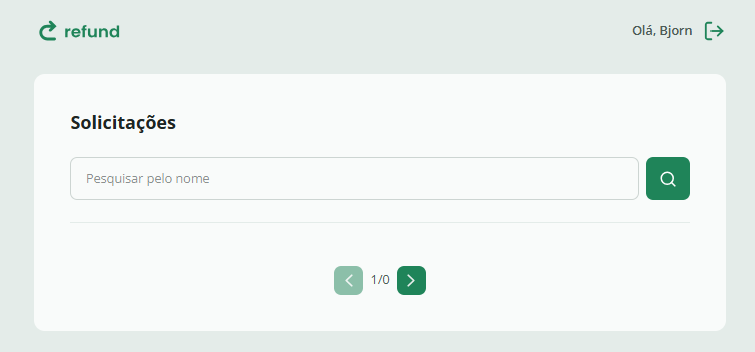

<h1 align="center"> Refund - Sistema de Reembolso Corporativo </h1>

<p align="center">
  Uma plataforma web completa para gestão de reembolsos de despesas, com perfis de acesso distintos e fluxo de aprovação.
</p>

<p align="center">
  <a href="#-tecnologias">Tecnologias</a>&nbsp;&nbsp;&nbsp;|&nbsp;&nbsp;&nbsp;
  <a href="#-projeto">Projeto</a>&nbsp;&nbsp;&nbsp;|&nbsp;&nbsp;&nbsp;
  <a href="#-funcionalidades">Funcionalidades</a>&nbsp;&nbsp;&nbsp;|&nbsp;&nbsp;&nbsp;
  <a href="#-como-rodar">Como Rodar</a>&nbsp;&nbsp;&nbsp;|&nbsp;&nbsp;&nbsp;
  <a href="#memo-licença">Licença</a>
</p>

<p align="center">
  
</p>

<br>

<p align="center">
  
</p>

## 🚀 Tecnologias

Este projeto foi desenvolvido com as tecnologias mais modernas do ecossistema React:

- **[React](https://reactjs.org/)** (Biblioteca de interfaces)
- **[TypeScript](https://www.typescriptlang.org/)** (Tipagem estática e segurança)
- **[Vite](https://vitejs.dev/)** (Build tool de ultra velocidade)
- **[Axios](https://axios-http.com/)** (Consumo de API REST)
- **[Context API](https://reactjs.org/docs/context.html)** (Gerenciamento de estado global e Auth)
- **[React Router DOM](https://reactrouter.com/)** (Roteamento e navegação)

## 💻 Projeto

O **Refund** é a interface web de um ecossistema Full-Stack para controle de despesas corporativas.
Diferente de versões anteriores, esta aplicação é uma SPA (Single Page Application) que implementa controle de acesso baseado em cargos (**RBAC** - Role Based Access Control) diretamente no front-end.

O sistema divide os usuários em dois perfis:
1.  **Colaborador (Employee):** Pode cadastrar novas solicitações de reembolso, enviar comprovantes (upload) e visualizar o histórico de seus pedidos.
2.  **Gestor (Manager):** Possui acesso a um dashboard administrativo para visualizar, filtrar e aprovar/rejeitar as solicitações da equipe.

## ✨ Funcionalidades

- **Autenticação:** Login e Cadastro integrados ao Contexto da aplicação.
- **Rotas Protegidas:** Sistema inteligente que redireciona o usuário para telas específicas dependendo do seu cargo (`manager` ou `employee`).
- **Upload de Comprovantes:** Componente de *Drag and Drop* para envio de imagens das notas fiscais.
- **Listagem Paginada:** Visualização de reembolsos com paginação e filtros por categoria.
- **Feedback Visual:** Telas de "Sucesso" (Confirm) e tratamento de erros de API.

## 🎲 Como Rodar

```bash
# Clone este repositório
$ git clone [https://github.com/miqueiassantoss/refund.git](https://github.com/miqueiassantoss/refund.git)

# Acesse a pasta do projeto
$ cd refund

# Instale as dependências
$ npm install

# Inicie a aplicação
$ npm run dev

# O projeto rodará na porta:5173


```

## 📝 Licença

Esse projeto está sob a licença MIT.

---

<p align="center">
  Feito por <a href="https://github.com/miqueiassantoss">Miqueias Santos</a>
</p>